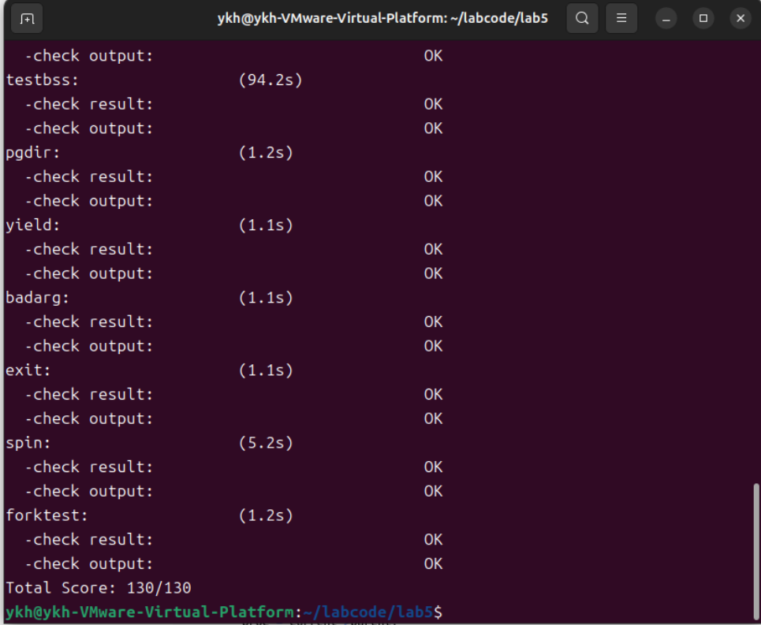
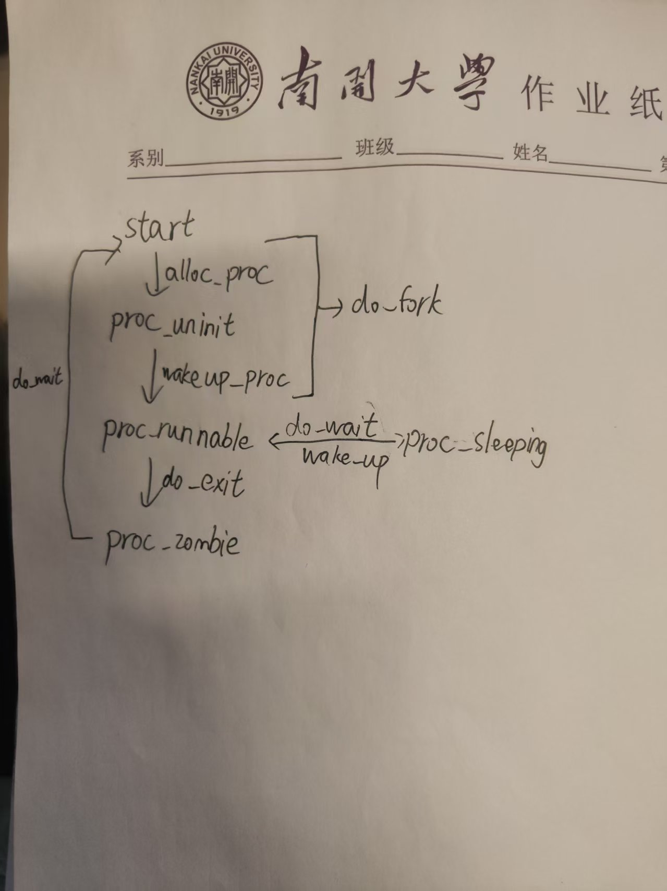

# Lab5

## 练习0：填写已有实验 //by 潘涛

## 练习0要求：本实验依赖实验2/3/4。请把你做的实验2/3/4的代码填入本实验中代码中有“LAB2”/“LAB3”/“LAB4”的注释相应部分。注意：为了能够正确执行 lab5 的测试应用程序，可能需对已完成的实验2/3/4的代码进行进一步改进。

修改proc.c/alloc_proc函数如下，新增wait_state和cptr/yptr/optr等进程关系指针，并进行初始化。

```cpp
static struct proc_struct *
alloc_proc(void)
{
    struct proc_struct *proc = kmalloc(sizeof(struct proc_struct));
    if (proc != NULL)
    {
        proc->state = PROC_UNINIT;
        proc->pid = -1;
        proc->runs = 0;
        proc->kstack = 0;
        proc->need_resched = 0;
        proc->parent = NULL;
        proc->mm = NULL;
        memset(&(proc->context),0,sizeof(struct context));
        proc->tf = NULL;
        proc->pgdir = boot_pgdir_pa;
        proc->flags = 0;
        memset(proc->name,0,PROC_NAME_LEN+1);
        proc->wait_state = 0;
        proc->cptr = NULL;
        proc->yptr = NULL;
        proc->optr = NULL;
    }
    return proc;
}
```

修改proc.c/do_fork函数如下，

```cpp
int do_fork(uint32_t clone_flags, uintptr_t stack, struct trapframe *tf)
{
    int ret = -E_NO_FREE_PROC;
    struct proc_struct *proc;
    if (nr_process >= MAX_PROCESS)
    {
        goto fork_out;
    }
    ret = -E_NO_MEM;
    if((proc = alloc_proc()) == NULL){// 创建pcb
        goto fork_out;
    }
    proc->parent = current; // 设置父进程为current

    assert(current->wait_state == 0); // 确保当前进程没有处于等待状态

    if(setup_kstack(proc) != 0 ){// 调用setup_kstack分配内核栈
        goto bad_fork_cleanup_proc;
    }
    if(copy_mm(clone_flags , proc) != 0 ){//调用copy_mm 复制父进程内存信息
        goto bad_fork_cleanup_kstack;
    }
    copy_thread(proc , stack ,tf); //调用copy_thread 复制上下文和中断帧
    
    bool intr_flag;
    local_intr_save(intr_flag);// 关中断
    {
        proc->pid = get_pid();//分配id
        hash_proc(proc);//放入hash链表
        set_links(proc);
    }
    local_intr_restore(intr_flag);//开中断
    wakeup_proc(proc);//唤醒新进程
    ret =  proc->pid;//返回pid
fork_out:
    return ret;

bad_fork_cleanup_kstack:
    put_kstack(proc);
bad_fork_cleanup_proc:
    kfree(proc);
    goto fork_out;
}
```

修改trap.c/interrupt_handler函数如下，设置时间片轮转，每100次判断是否需要重新调度。

```cpp
case IRQ_S_TIMER:

    /* 时间片轮转： 
    *(1) 设置下一次时钟中断（clock_set_next_event）
    *(2) ticks 计数器自增
    *(3) 每 TICK_NUM 次中断（如 100 次），进行判断当前是否有进程正在运行，如果有则标记该进程需要被重新调度（current->need_resched）
    */
    clock_set_next_event();
    ticks++;
    if(ticks%TICK_NUM==0&&current){
        current->need_resched=1;
    }
    break;
```

## 练习1 加载应用程序并执行 //by 潘涛

## 练习1要求：do_execve函数调用load_icode（位于kern/process/proc.c中）来加载并解析一个处于内存中的ELF执行文件格式的应用程序。你需要补充load_icode的第6步，建立相应的用户内存空间来放置应用程序的代码段、数据段等，且要设置好proc_struct结构中的成员变量trapframe中的内容，确保在执行此进程后，能够从应用程序设定的起始执行地址开始执行。需设置正确的trapframe内容。在实验报告中简要说明你的设计实现过程，并简要描述这个用户态进程被ucore选择占用CPU执行（RUNNING态）到具体执行应用程序第一条指令的整个经过。

### 回答

#### 1. 设计实现过程

load_icode的最后一步是设置当前进程的中断帧，以便当内核通过 sret 指令从中断/异常返回时，CPU 能够正确地切换到用户态，并跳转到新加载的应用程序入口处开始执行。

- 设置用户栈指针（tf->gpr.sp）:在前面的步骤中，我们已经建立了用户栈的内存映射，栈顶定义为 USTACKTOP。因此，将 tf->gpr.sp 设置为 USTACKTOP，确保用户程序开始运行时拥有合法的栈空间

- 设置程序入口地址 (tf->epc)：epc寄存器存储了发生异常/中断时的指令地址（或sert返回的目标地址），将 ELF 可执行文件头中记录的入口地址 elf->e_entry 赋值给 tf->epc。这样，当内核返回时，CPU 就会跳转到用户程序的 _start 位置开始执行。

- 设置状态寄存器 (tf->status)：我们需要修改 sstatus 寄存器的相关位来控制特权级切换和中断状态。PP 记录了进入 Trap 之前的特权级。因为我们要返回到用户态，所以必须将此位清零。SPIE 记录了进入 Trap 之前的中断使能状态。为了让用户程序在运行时能够响应中断，设为1。

代码实现如下：

```cpp
tf->gpr.sp = USTACKTOP;
tf->epc = elf->e_entry;
tf->status = (sstatus & ~SSTATUS_SPP) | SSTATUS_SPIE;
```

#### 2. 大致的执行过程如下：

（1）首先，需要清空用户态内存空间，以准备加载新的执行代码。这个过程由 do_execve 实现。

（2） 加载应用程序执行代码并建立用户环境。接下来，内核需要完成以下任务，主要由 load_icode 实现：读取 ELF 格式的执行文件：解析并加载用户程序的执行代码、申请内存空间并建立用户态虚拟内存

（3）此时，内核需要更新进程的虚拟内存空间。具体地，通过将 mm->pgdir 的值赋给 cr3 寄存器，来完成进程虚拟地址空间的切换。这样可以确保进程能够访问自己的虚拟内存空间

（4）内核需要清空并重新设置进程的中断帧，以确保进程在执行中断返回指令 iret 后，能够正确地转入用户态。

一些详细的函数调用流程如下:

- 首先，在init_main函数中，通过调用通过调用int pid = kernel_thread(user_main, NULL, 0)来调用do_fork函数，创建并唤醒进程，执行函数user_main，此时线程状态已经变为PROC_RUNNABLE，表明该线程开始运行；
- 进入user_main函数中，执行KERNEL_EXECVE(exit)，相当于调用了kern_execve函数
- 在kernel_execve中执行到ebreak之后，发生断点异常，转到__alltraps，转到trap，再到trap_dispatch，然后到exception_handler，再到CAUSE_BREAKPOINT处，最后调用syscall函数
- 在syscall中根据参数，确定执行sys_exec，调用do_execve
- 在do_execve中调用load_icode，加载文件
- 在load_icode() 成功后 do_execve() 会把 current->name 改成新程序名并返回，syscall 处理完 trap() 会检 current->need_resched，如果需要就 schedule() 选择 RUNNABLE 的这个进程。
- schedule调用proc_run这个函数，执行switch_to函数返回到forkret->_trapret，然后恢复上下文
- 最后sret，返回到用户态，并跳转到elf文件的入口处，开始执行程序。

## 练习2: 父进程复制自己的内存空间给子进程 // by 叶坤豪

## 练习2要求：创建子进程的函数do_fork在执行中将拷贝当前进程（即父进程）的用户内存地址空间中的合法内容到新进程中（子进程），完成内存资源的复制。具体是通过copy_range函数（位于kern/mm/pmm.c中）实现的，请补充copy_range的实现，确保能够正确执行。请在实验报告中简要说明你的设计实现过程。如何设计实现Copy on Write机制？给出概要设计，鼓励给出详细设计。

### 1.copy_range的实现
copy_range函数的主要功能是将父进程的内存空间复制到子进程中。实现的关键步骤包括：

1.获取源页的内核虚拟地址：通过page2kva将父进程的物理页面转换为内核虚拟地址

2.分配新页面给子进程：使用alloc_page为子进程分配新的物理页面

3.内存内容复制：将父进程页面的内容复制到子进程的新页面

4.建立页表映射：将新页面映射到子进程的地址空间中

在kern/mm/pmm.c中的copy_range函数中添加以下代码：
```c
            // (1) 获取源页的内核虚拟地址
            uintptr_t src_kvaddr = page2kva(page);
            
            // (2) 获取目标页的内核虚拟地址
            uintptr_t dst_kvaddr = page2kva(npage);
            
            // (3) 内存拷贝，将源页面的内容（整个页面，PGSIZE大小）复制到目标页面
            memcpy((void *)dst_kvaddr, (void *)src_kvaddr, PGSIZE);
            
            // (4) 建立页表映射
            ret = page_insert(to, npage, start, perm);
            if (ret != 0) {
                free_page(npage);
                return ret;
            }
```
完成代码的整合编写之后，我们运行make grade，得到以下结果，score满分，说明我们的实现无误。



### 2.实现 “Copy on Write” 机制
 “Copy on Write” 机制的主要思想为使得进程执行 fork 系统调用进行复制的时候，父进程不会简单地将整个内存中的内容复制给子进程，而是暂时共享相同的物理内存页；而当其中一个进程需要对内存进行修改的时候，再额外创建一个自己私有的物理内存页，将共享的内容复制过去，然后在自己的内存页中进行修改。概要设计如下：

do fork 部分：在进行内存复制的部分，不实际进行内存的复制，而是将子进程和父进程的虚拟页映射上同一个物理页面，共享父进程的mm_struct，然后在分别在这两个进程的虚拟页对应的 PTE 部分将这个页置成是不可写的。

page fault 部分：对当前的异常增加是否由尝试写了某一个共享页面引起的检查，如果是则额外申请分配一个物理页面，然后将当前的共享页的内容复制过去，建立出错的线性地址与新创建的物理页面的映射关系，将 PTE 设置设置成非共享的；然后查询原先共享的物理页面是否还是由多个其它进程共享使用的，如果不是，就将对应的虚地址的 PTE 进行修改，删掉共享标记，恢复写标记；这样的话 page fault 返回之后就可以正常完成对虚拟内存的写操作了。

## 练习3 阅读分析源代码，理解进程执行 fork/exec/wait/exit 的实现，以及系统调用的实现 //by 翟玉坤

## 练习3要求：请在实验报告中简要说明你对 fork/exec/wait/exit函数的分析。并分别分析fork/exec/wait/exit的执行流程。重点关注哪些操作是在用户态完成，哪些是在内核态完成？内核态与用户态程序是如何交错执行的？内核态执行结果是如何返回给用户程序的？以及给出ucore中一个用户态进程的执行状态生命周期图（包执行状态，执行状态之间的变换关系，以及产生变换的事件或函数调用）

### fork/exec/wait/exit函数分析

- fork: 对于本函数，主要作用在于为该进程的父进程赋值为当前的进程，`setup_kstack`完成了内核栈空间的分配；`copy_mm`完成了分配新的虚拟内存或与其他线程共享虚拟内存；`copy_thread`获取了原线程的上下文与中断帧，并且设置了当前线程的上下文与中断帧；然后，为新进程获取新的`pid`进程号，并且赋值给该进程。然后将新线程插入哈希表和链表中，唤醒该新建的进程，返回该进程的`pid`号。

- exec：对于本函数，主要用于创建用户空间以及加载用户程序。此函数负责完成当前线程的虚拟内存空间的回收，以及为当前线程分配新的虚拟内存空间，加载应用程序。

- wait: 本函数首先会查找状态为`PROC_ZOMBIE`的子线程；如果找到了，就将线程从哈希表和链表中删除，最后释放线程的资源。如果查询到拥有子线程的线程，则设置线程状态并切换线程；如果线程已退出，则调用`do_exit`函数。

- exit: 对于本函数，如果当前线程的虚拟内存没有用于其他线程，则销毁该虚拟内存,如果已经用于其他线程，就将当前线程状态设为`PROC_ZOMBIE`，唤醒该线程的父线程,完成`exit`后，调用`schedule`切换到其他线程。

其中系统调用的部分在内核态进行，用户程序的执行在用户态进行；内核态通过系统调用结束后的`sret`指令来切换到用户态，用户态通过发起系统调用来产生`ebreak`异常，从而切换到内核态；内核态执行的结果通过`kernel_execve_ret`函数将中断帧添加到线程的内核栈中，从而将结果返回给用户。

ucore中一个用户态进程的执行状态生命周期图如下



## Challenge2 //by 翟玉坤

## Challenge2要求：说明该用户程序是何时被预先加载到内存中的？与我们常用操作系统的加载有何区别，原因是什么？

### 回答：

- 预加载时机和区别对比
在ucore的实现中，程序在do_execve函数中被显式加载到内存。调用load_icode函数，依次将ELF文件的文件头、程序头、程序段内容按页加载到内存空间中。在程序执行之前，所有需要的内容都已经加载到了内存中。而对于传统操作系统，其广泛使用懒加载（Lazy Loading）机制，在execve中，只会加载文件头、程序头表，并分配内存区域，但此时并不会将程序段内容（代码段、数据段等）加载过来。当程序开始执行时，以“按需加载”的方式，访问到某个虚拟地址时，若还没映射到物理地址，会通过缺页异常，从磁盘加载对应的页面内容，并更新页表。

- 原因
ucore的一次性加载简化了内存管理，更适合嵌入式系统和教学应用；并且懒加载的方式减少了初始内存占用；在执行过程中，仅加载执行路径中实际需要的段，减少了内存占用和磁盘 I/O。有助于提高整体性能。同时需要完善的页表和缺页异常处理机制来支持。


