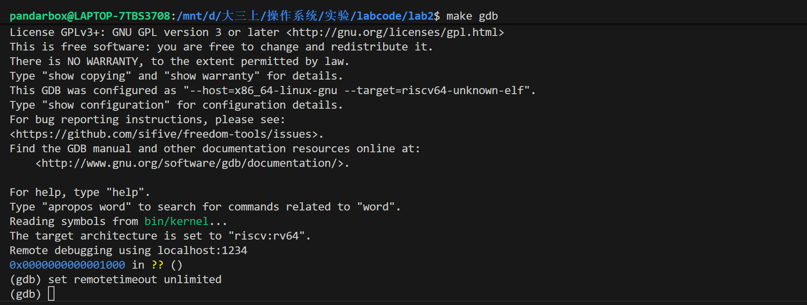
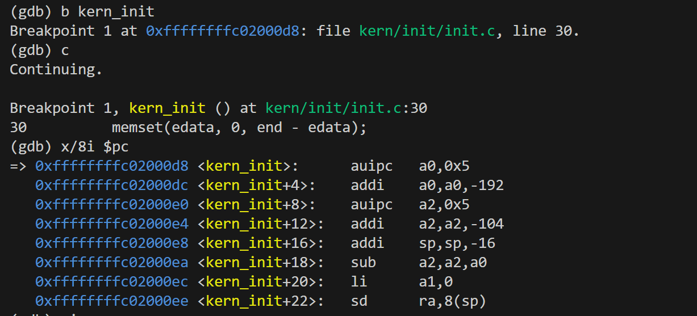
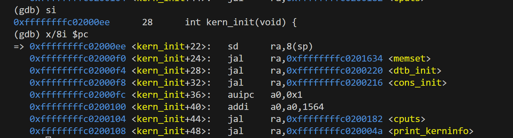
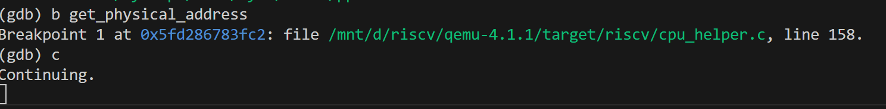
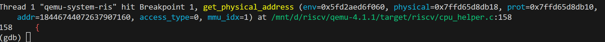
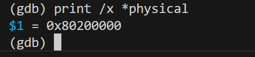
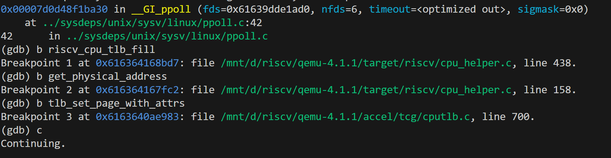
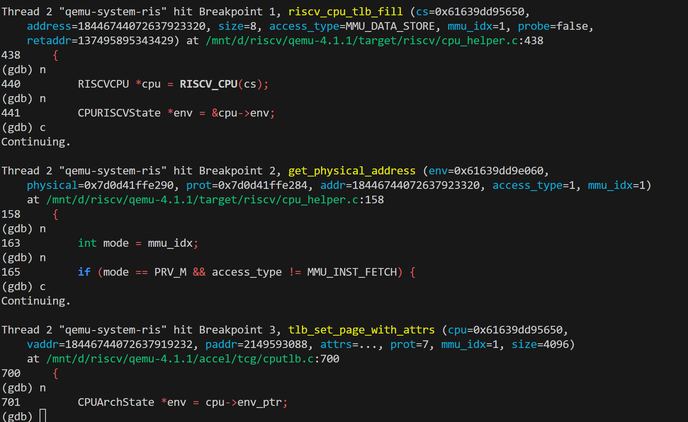
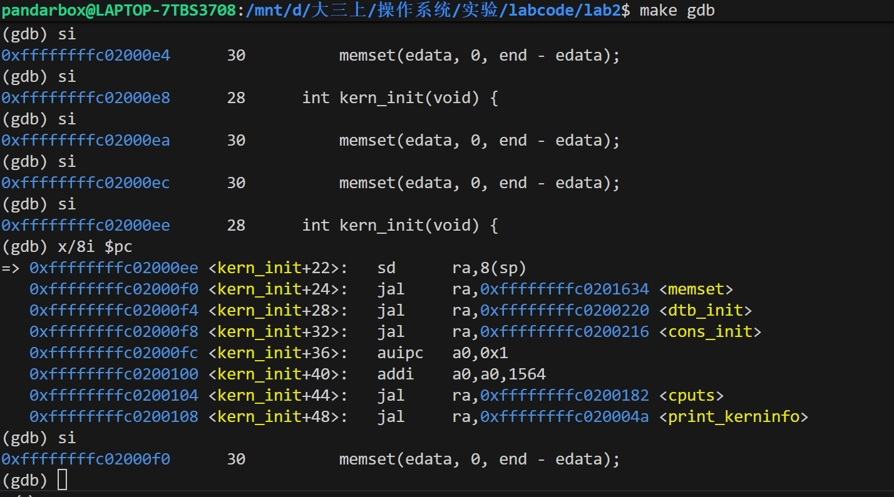

## 分支任务1：gdb调试页表查询过程

### 环境准备

1. 本次实验需要一个完整的QEMU。我们按照实验指导书中的步骤要求，配置环境:

```bash
# 进入QEMU源码目录
cd qemu-4.1.1

# 清理之前的编译结果
make distclean

# 重新配置，带上调试选项
./configure --target-list=riscv32-softmmu,riscv64-softmmu --enable-debug

# 重新编译
make -j$(nproc)
```

接下来，我们修改ucore的makefile,让它使用我们新编译的调试版QEMU:

```bash
ifndef QEMU
QEMU := /mnt/d/riscv/qemu-4.1.1/riscv64-softmmu/qemu-system-riscv64
endif
```

---

2. 准备三个终端，进行调试：

终端一：我们在总端中输入$make debug$负责启动QEMU模拟器，并暂停在初始状态。

终端二：使用普通的gdb命令，附加到QEMU进程本身，用于调试QEMU的源码。我们在2中依次执行以下命令：

- 查找 QEMU 的进程号 (PID)：pgrep -f qemu-system-riscv64
- 启动 GDB：sudo gdb 
- attach：attach PID
- 忽略干扰信号: handle SIGPIPE nostop noprint
- 让qemu待命：continue


终端三：主要使用riscv64-unknown-elf-gdb，通过QEMU提供的调试接口连接，用于调试运行在模拟器中的ucore内核。我们使用命令make gdb进行调试。然后使用命令set remotetimeout unlimited来解决时序问题。 




### 调试访存指令的物理地址翻译过程：

#### 调试要求

尝试理解我们调试流程中涉及到的qemu的源码，给出关键的调用路径，以及路径上一些关键的分支语句，并通过调试演示某个访存指令访问的虚拟地址是如何在qemu的模拟中被翻译成一个物理地址的。

单步调试页表翻译的部分，解释一下关键的操作流程。

#### 调试过程

1. 与大模型交流得知，qemu中实现翻译功能的函数是get_physical_address，它在 TLB 未命中时被 tlb_fill() 调用，完成虚拟地址到物理地址的页表步进和权限检查。因此我们需要在ucore中找到一个访存指令打上断点，然后再qemu中的get_physical_address处打上断点。通过执行访存指令时，再qemu中观察实现过程。

2. 具体的调试过程如下:

（1）我们在终端3 ucore中使用指令**b kern_init**处打上断点，然后continue继续执行到相关指令处，我们发现程序停在memset(edata, 0, end - edata);处，这是一个访存指令。我们使用x/8i $pc查看该处的相关指令。可以看到指令sd ra,8(sp)，表示将寄存器 ra 中的 64 位数据，存储到内存地址 sp + 8 处，即为我们需要的访存指令。



我们使用si单步调试到该指令执行前一条指令，如下：



（2）我们在终端2中，使用指令**b get_physical_address**在qemu对应函数处打下断点，然后继续执行：



（3）我们在终端3真正执行这条访存指令，发现程序停在这个指令上。在终端2中输出以下内容，表明我们现在成功进入到了这个函数入口，正在等待计算物理地址。其中addr=18446744072637907160，转化为16进制，即为0xFFFFFFFFC0200000，这正是 ucore 内核空间的一个虚拟地址；同时mmu_idx=1，表示前处于 Supervisor 模式（内核态）。



然后，我们使用单步执行，观察 QEMU 是如何模拟硬件 MMU 的工作的。

首先进入get_physical_address函数后，第一个判断语句access_type != MMU_INST_FETCH表示当前这次内存访问不是“取指令”，而是数据访问。第二个if语句是表示如果是在 M-Mode 或者 CPU 根本没有 MMU 功能，那么虚拟地址直接等于物理地址，不需要查表。而现在 S-Mode，且有 MMU，所以这个 if 条件为假，跳过。代码继续向下执行，准备进行真正的地址翻译。

```cpp
(gdb) n
163         int mode = mmu_idx;
(gdb) n
165         if (mode == PRV_M && access_type != MMU_INST_FETCH) {
(gdb) n
171         if (mode == PRV_M || !riscv_feature(env, RISCV_FEATURE_MMU)) {
```

然后是解析 SATP，确定页表格式。其中，base表示根页表的物理地址;SUM 控制 S 模式是否允许访问标记为 U（用户页）的页面;vm表示从satp中取出MOOE字段，表示
当前地址翻译模式（Bare/Sv39/Sv48…）。然后switch根据vm设置页表参数。由于我们的页表是s39，所以
- levels = 3：三级页表。
- ptidxbits = 9：每一级页表索引占 9 位。
- ptesize = 8：每个页表项 (PTE) 占 8 字节 (64位)。
  
```cpp
(gdb) n
177         *prot = 0;
(gdb) n
181         int mxr = get_field(env->mstatus, MSTATUS_MXR);
(gdb) n
183         if (env->priv_ver >= PRIV_VERSION_1_10_0) {
(gdb) n
184             base = get_field(env->satp, SATP_PPN) << PGSHIFT;
(gdb) n
185             sum = get_field(env->mstatus, MSTATUS_SUM);
(gdb) n
186             vm = get_field(env->satp, SATP_MODE);
(gdb) n
187             switch (vm) {
(gdb) n
191               levels = 3; ptidxbits = 9; ptesize = 8; break;
```

然后是虚拟地址的合法性检查部分。
```python
(gdb) n
223         CPUState *cs = env_cpu(env);
(gdb) n
224         int va_bits = PGSHIFT + levels * ptidxbits;
(gdb) n
225         target_ulong mask = (1L << (TARGET_LONG_BITS - (va_bits - 1))) - 1;
(gdb) n
226         target_ulong masked_msbs = (addr >> (va_bits - 1)) & mask;
(gdb) n
227         if (masked_msbs != 0 && masked_msbs != mask) {
```

接着是，再页表中查询页表项，然后进行物理地址的翻译。首先是多级页表的遍历主循环，实现一层一层的查页表（i=0，表示从定义页表开始查询，然后下面的集几行代码实现了定位并读取 PTE，主要流程是
- 从 VA 中取当前层的 VPN[i]
- 计算该 PTE 在内存中的物理地址
- 从物理内存中读出 PTE
- 取出 PTE 里的 PPN

```cpp
231         int ptshift = (levels - 1) * ptidxbits;
(gdb) n
237         for (i = 0; i < levels; i++, ptshift -= ptidxbits) {
(gdb) n
238             target_ulong idx = (addr >> (PGSHIFT + ptshift)) &
(gdb) n
239                                ((1 << ptidxbits) - 1);
(gdb) n
238             target_ulong idx = (addr >> (PGSHIFT + ptshift)) &
(gdb) n
242             target_ulong pte_addr = base + idx * ptesize;
(gdb) n
244             if (riscv_feature(env, RISCV_FEATURE_PMP) &&
(gdb) n
245                 !pmp_hart_has_privs(env, pte_addr, sizeof(target_ulong),
(gdb) n
244             if (riscv_feature(env, RISCV_FEATURE_PMP) &&
(gdb) n
252             target_ulong pte = ldq_phys(cs->as, pte_addr);
(gdb) n
254             target_ulong ppn = pte >> PTE_PPN_SHIFT;
```

经过一些系列的合法性检查后，把虚拟地址真正翻译成物理地址：
- 高位：来自 PTE 的 PPN
- 中间位：superpage 情况下来自 VA
- 低 12 位：页内偏移

```cpp
333                 target_ulong vpn = addr >> PGSHIFT;
(gdb) n
334                 *physical = (ppn | (vpn & ((1L << ptshift) - 1))) << PGSHIFT;
```

最后，设置 TLB 权限并返回，对应硬件把翻译结果缓存进 TLB。
```cpp
(gdb) n
347                     *prot |= PAGE_WRITE;
(gdb) n
349                 return TRANSLATE_SUCCESS;
```

经过一系列操作最后得到转化的物理地址为0x802000000




### TLB相关的调试

#### 调试要求

是否能够在qemu-4.1.1的源码中找到模拟cpu查找tlb的C代码，通过调试说明其中的细节。（按照riscv的流程，是不是应该先查tlb，tlbmiss之后才从页表中查找，给我找一下查找tlb的代码）

仍然是tlb，qemu中模拟出来的tlb和我们真实cpu中的tlb有什么逻辑上的区别（提示：可以尝试找一条未开启虚拟地址空间的访存语句进行调试，看看调用路径，和开启虚拟地址空间之后的访存语句对比）

#### 调试过程

**1. 是否能够在qemu-4.1.1的源码中找到模拟cpu查找tlb的C代码，通过调试说明其中的细节。**

经过与大模型的交流，我了解到tlb的相关执行流程是：

- 读/取指/写的查 TLB 与 miss 处理：
  - load_helper() / store_helper()：先用 tlb_hit(...) 判断当前页是否命中；不命中再尝试 victim_tlb_hit(...)；仍 miss 调用 tlb_fill(...)。
  - tlb_fill(...)：统一 miss 入口，调用 CPU 类回调（RISC-V 对应 riscv_cpu_tlb_fill，再调 get_physical_address）。

- 查表回填：
  - tlb_set_page_with_attrs()：被 riscv_cpu_tlb_fill 调用，向 TLB 写入新条目。

**调试方法**

我们在qemu调试中设置如下断点，来探究访存指令先在tlb这查询，然后miss之后，在页表中查询，然后写回的过程。

```bash
(gdb) b riscv_cpu_tlb_fill
(gdb) b get_physical_address
(gdb) b tlb_set_page_with_attrs
(gdb) c
```



在ucore调试中仍然在kern_init处进行断点操作，通过其中的访存指令来验证。由于sd ra,8(sp)指令是ucore的第一个访存指令，因此tlb中没有，会导致tlb miss，然后通过在内存中找到，在写入tlb。我们单步执行这条指令，ucore停住，我们在qemu终端中，逐步观察这一个阶段。

在qemu的调试终端中，我们发现源码在之前提到的三个关键函数中停止，体现了在tlb miss时会先转到risv_cpu_tlb_fill中处理，然后再通过get_pthyscal_address得到物理地址，在内存中找到对应的地址，然后再通过函数tlb_set_page_with_attrs将其写到tlb中。



我们继续执行，可以看到ucore中对应的sd指令成功执行，等待下一步的调试指令，标志着整个访存过程成功




然后，我们进入函数内部详细分析这个过程：

我们尝试理解store_helper函数：当 QEMU 执行一条 store 指令时，store_helper 首先根据当前访存上下文计算本次访问所使用的 MMU 索引 mmu_idx，并由虚拟地址 addr 定位到对应的软件 TLB 表项。随后对访问地址进行对齐检查，若地址不满足指令要求的对齐约束，则触发相应的非对齐访问异常。完成对齐检查后，QEMU 判断当前 TLB 表项是否命中该虚拟地址；若未命中，则进一步检查 victim TLB，若仍未命中，则调用 tlb_fill 进入慢路径，对该虚拟地址进行地址翻译与权限检查并填充 TLB，为后续的内存写操作做好准备。

```cpp
static inline void __attribute__((always_inline))
store_helper(CPUArchState *env, target_ulong addr, uint64_t val,
             TCGMemOpIdx oi, uintptr_t retaddr, size_t size, bool big_endian)
{
    uintptr_t mmu_idx = get_mmuidx(oi);
    uintptr_t index = tlb_index(env, mmu_idx, addr);
    CPUTLBEntry *entry = tlb_entry(env, mmu_idx, addr);
    target_ulong tlb_addr = tlb_addr_write(entry);
    const size_t tlb_off = offsetof(CPUTLBEntry, addr_write);
    unsigned a_bits = get_alignment_bits(get_memop(oi));
    void *haddr;

    /* Handle CPU specific unaligned behaviour */
    if (addr & ((1 << a_bits) - 1)) {
        cpu_unaligned_access(env_cpu(env), addr, MMU_DATA_STORE,
                             mmu_idx, retaddr);
    }

    /* If the TLB entry is for a different page, reload and try again.  */
    if (!tlb_hit(tlb_addr, addr)) {
        if (!victim_tlb_hit(env, mmu_idx, index, tlb_off,
            addr & TARGET_PAGE_MASK)) {
            tlb_fill(env_cpu(env), addr, size, MMU_DATA_STORE,
                     mmu_idx, retaddr);
            index = tlb_index(env, mmu_idx, addr);
            entry = tlb_entry(env, mmu_idx, addr);
        }
        tlb_addr = tlb_addr_write(entry) & ~TLB_INVALID_MASK;
    }
```

查看riscv_cpu_tlb_fill: 在 RISC-V 架构下处理一次 TLB 未命中的情况，通过调用页表遍历函数将虚拟地址翻译为物理地址并进行权限与 PMP 检查，若翻译成功则将结果写入 QEMU 的软件 TLB 以加速后续访问，若失败则根据访问类型触发相应的访存异常并返回到 CPU 执行主循环

```cpp
bool riscv_cpu_tlb_fill(CPUState *cs, vaddr address, int size,
                        MMUAccessType access_type, int mmu_idx,
                        bool probe, uintptr_t retaddr)
{
#ifndef CONFIG_USER_ONLY
    /* 获取 RISC-V CPU 和其运行时状态 env */
    RISCVCPU *cpu = RISCV_CPU(cs);
    CPURISCVState *env = &cpu->env;

    /* pa: 翻译得到的物理地址
     * prot: 页表/权限检查后得到的访问权限 */
    hwaddr pa = 0;
    int prot;

    /* 标记是否发生 PMP 违规 */
    bool pmp_violation = false;

    /* 地址翻译返回值，默认失败 */
    int ret = TRANSLATE_FAIL;

    /* 当前访存所使用的特权级（来自 mmu_idx） */
    int mode = mmu_idx;

    /*调用页表遍历函数，根据虚拟地址进行地址翻译，得到物理地址 pa 和权限 prot*/
    ret = get_physical_address(env, &pa, &prot,
                               address, access_type, mmu_idx);
    
    /* 处理 MPRV 机制*/
    if (mode == PRV_M && access_type != MMU_INST_FETCH) {
        if (get_field(env->mstatus, MSTATUS_MPRV)) {
            mode = get_field(env->mstatus, MSTATUS_MPP);
        }
    }

    ......

    /* PMP（Physical Memory Protection）检查*/
    if (riscv_feature(env, RISCV_FEATURE_PMP) &&
        (ret == TRANSLATE_SUCCESS) &&
        !pmp_hart_has_privs(env, pa, size,
                            1 << access_type, mode)) {
        ret = TRANSLATE_PMP_FAIL;
    }
    ......

    /* 翻译成功：将该虚拟页到物理页的映射
        填充到 QEMU 的软件 TLB 中*/
    if (ret == TRANSLATE_SUCCESS) {
        tlb_set_page(cs,
                     address & TARGET_PAGE_MASK,   /* 虚拟页地址 */
                     pa & TARGET_PAGE_MASK,        /* 物理页地址 */
                     prot,                         /* 权限 */
                     mmu_idx,
                     TARGET_PAGE_SIZE);
        return true;
    }
    ......
}
```

查看tlb_set_page_with_attrs()：在地址翻译成功后，将虚拟页到物理页的映射结果写入 QEMU 的软件 TLB。函数首先根据虚拟地址计算 TLB 索引并加锁，清除该虚拟页可能存在的旧翻译；若原有表项属于不同页，则将其转移到 victim TLB。随后根据物理内存类型和访问权限构造新的 TLB 表项（包含读/写/执行地址、addend 以及 MMIO 等标志），同时更新 iotlb 信息，最后将新表项写入主 TLB 并解锁。完成后，后续对该虚拟页的访存即可直接通过 TLB 快路径访问，无需再次进行页表遍历。

```cpp
void tlb_set_page_with_attrs(...)
{
    ...
    CPUTLB *tlb = env_tlb(env);
    CPUTLBDesc *desc = &tlb->d[mmu_idx];
    ...
    index = tlb_index(env, mmu_idx, vaddr_page);
    te = tlb_entry(env, mmu_idx, vaddr_page);

    qemu_spin_lock(&tlb->c.lock);

    /* 标记 TLB 已被修改 */
    tlb->c.dirty |= 1 << mmu_idx;

    /* 清除该虚拟页可能已有的旧翻译 */
    tlb_flush_vtlb_page_locked(env, mmu_idx, vaddr_page);

    /* 若原表项有效且是不同页，则放入 victim TLB */
    if (!tlb_hit_page_anyprot(te, vaddr_page) && !tlb_entry_is_empty(te)) {
        unsigned vidx = desc->vindex++ % CPU_VTLB_SIZE;
        CPUTLBEntry *tv = &desc->vtable[vidx];
        copy_tlb_helper_locked(tv, te);
        desc->viotlb[vidx] = desc->iotlb[index];
        tlb_n_used_entries_dec(env, mmu_idx);
    }

    /* 填充主 TLB 的 iotlb */
    desc->iotlb[index].addr  = iotlb - vaddr_page;
    desc->iotlb[index].attrs = attrs;

    /* 构造新的 TLB 表项 */
    tn.addend = addend - vaddr_page;

    tn.addr_read  = (prot & PAGE_READ)  ? address      : -1;
    tn.addr_code  = (prot & PAGE_EXEC)  ? code_address : -1;
    tn.addr_write = -1;

    if (prot & PAGE_WRITE) {
        tn.addr_write = address;     /* 可能叠加 MMIO / NOTDIRTY / INVALID */
    }

    /* 写入主 TLB */
    copy_tlb_helper_locked(te, &tn);
    tlb_n_used_entries_inc(env, mmu_idx);

    qemu_spin_unlock(&tlb->c.lock);
}
```

**2.仍然是tlb，qemu中模拟出来的tlb和我们真实cpu中的tlb有什么逻辑上的区别**

**调试方法**

场景一：satp.MODE=BARE（未开虚拟地址）

- 终端 A：make debug 启动 QEMU，停在 gdbstub。
- 终端 C：make gdb，b 到一条早期 M 态、satp 还未写的访存指令（load/store），c 运行到该指令前一条。
- 执行这条访存。终端 B 会在 load_helper/store_helper 断下：
  - 看 mmu_idx 为 M 态；tlb_hit miss → tlb_fill → riscv_cpu_tlb_fill → get_physical_address。
  - 在 BARE 下，get_physical_address 很快直接返回 VA=PA，无多级页表步进。
  - 回到 tlb_set_page_with_attrs，仍会回填一条直映 TLB（后续命中）。
  - 可再次让终端 C 对同页访存，确认不再触发 tlb_fill（命中 TLB）。

场景二：satp=Sv39（已开虚拟地址，S 态）

- 让内核写好 satp 后（进入 S 态），在终端 C 选一条 S 态访存指令（如 kern_init 里的 sd），在其前一条停下。
- 执行该访存。终端 B 断到 store_helper/load_helper：
  - miss → tlb_fill → riscv_cpu_tlb_fill → get_physical_address：可单步看到三级页表步进、PTE.V/R/W/X 检查、SUM/MXR/MPRV 权限判定，必要时对齐检查（超级页）。
  - 成功后回到 tlb_set_page_with_attrs，写入 TLB 条目，可能带 TLB_RECHECK/TLB_MMIO/TLB_NOTDIRTY 标记。
- 再次对同页访存，应直接命中，不再触发 tlb_fill。


**结论**

真实 CPU 的 TLB 行为：

在真实的 RISC-V 处理器中，TLB 是由硬件实现的地址转换缓存，其工作前提是启用虚拟地址空间。当 CPU 处于物理地址模式（SATP.MODE = 0）时，访存指令直接使用物理地址访问内存，地址不经过 MMU 翻译过程，TLB 在逻辑上完全不参与工作。只有当启用虚拟地址模式（如 SV39，对应 SATP.MODE = 8）时，TLB 才会参与地址转换，用于缓存虚拟页号到物理页帧号的映射关系，从而加速后续的虚拟地址访问。

QEMU 的软件 TLB 实现：

EMU 作为软件模拟器，不仅需要模拟 Guest 体系结构的地址转换语义，还必须将 Guest 的访存请求映射到宿主机的真实内存地址。即使 Guest 运行在物理地址模式下，其使用的地址（例如 0x80200000）也不能直接作为宿主机地址使用，而必须转换为宿主进程可访问的内存地址。因此，QEMU 实现了一套统一的软件 TLB 机制，所有访存操作都会经过该地址转换层。在物理地址模式下，get_physical_address 函数会直接返回恒等映射（VA = PA），不进行页表遍历；而在虚拟地址模式下，则会按照 RISC-V 规范执行多级页表遍历，并将翻译结果填充到软件 TLB 中。

区别：

真实 CPU 中的 TLB 是 MMU 的组成部分，仅在虚拟地址模式下参与地址翻译，而在物理地址模式下完全不使用 TLB。相比之下，QEMU 中的软件 TLB 在所有模式下都会参与访存过程，因为它不仅承担了虚拟地址到物理地址的翻译功能，更承担了将 Guest 地址映射到 Host 地址的职责，同时也是 TCG 翻译执行机制的重要组成部分。

### 与大模型的交互

**场景 1：QEMU 地址翻译链路不清楚**

调试 ucore 的一次 sd 访存，想弄清 VA→PA 在 QEMU 里的具体调用链，但只知道会进 get_physical_address。先问大模型“访存时哪个函数做地址翻译”，拿到关键函数和调用链，再据此在 QEMU GDB 下布断点。

交互要点：大模型给出了链路 store_helper → tlb_fill → riscv_cpu_tlb_fill → get_physical_address → tlb_set_page_with_attrs，并提示相关文件（accel/tcg/cputlb.c、target/riscv/cpu_helper.c）。依据这些信息设置断点，单步观察页表步进和 TLB 回填。


**场景 2：TLB 行为与硬件差异、如何对比 BARE vs Sv39 调用路径**

需要解释 QEMU 软 TLB 与真实硬件 TLB 的逻辑差别，并用实操调试对比“未开虚拟地址（BARE）”和“开启页表（Sv39）”的访存路径。先让大模型总结差异点，再让它给出可执行的调试步骤（断点设置、在哪个阶段停、预期看到什么）。

交互要点：大模型列出软 TLB 结构（直接映射+victim）、RECHECK/MMIO/NOTDIRTY 标志、缺乏硬件时序等差异，并给出三终端调试流程：场景一 BARE 下 VA=PA 直通但仍回填 TLB；场景二 Sv39 下触发多级页表查找与权限检查。依据步骤实操，成功看到两种模式下的不同调用路径。


