## 分支任务2：gdb 调试系统调用以及返回

### 1.ecall指令的跟踪

首先我们打开三个终端配置好环境，并在syscall的位置打上断点。

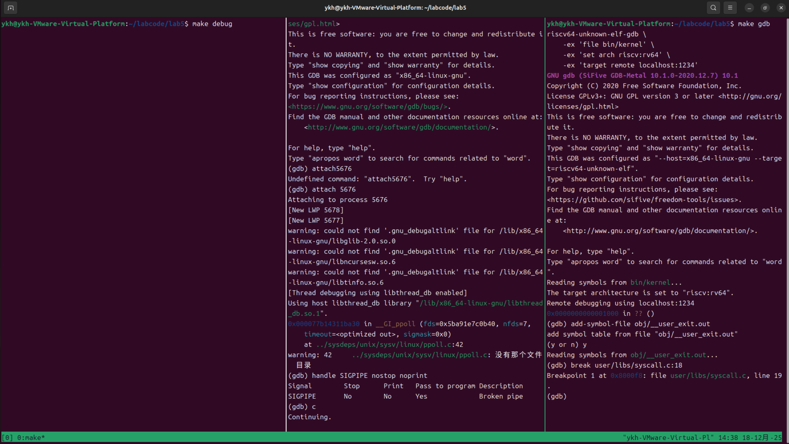

然后输入c运行调试，ucore就会停在syscall函数的位置。接着我们输入x/8i $pc,显示当前指令之后的几条汇编指令，就可以找到我们想要的ecall指令的位置。

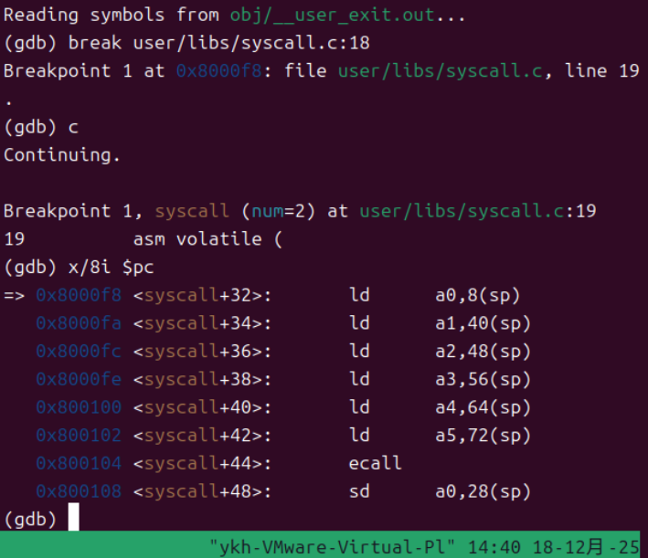

找到之后，我们控制代码执行到ecall指令前停下，然后在第二个终端输入ctrl+c停止，添加一个断点break trans_ecall.

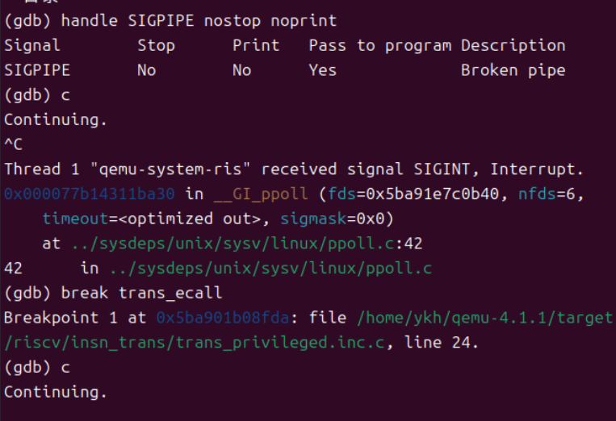

打完断点后，输入continue继续运行gdb，然后在第三个终端输入si单步调试，由于此时运行了ecall指令，第二个终端就会触发断点。

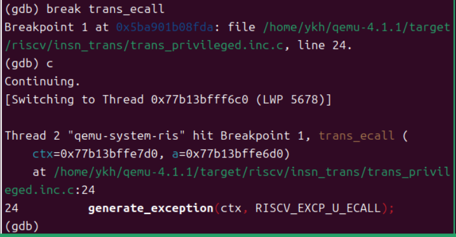

现在我们可以开始跟踪执行指令，我们先输入bt，查看调用栈。

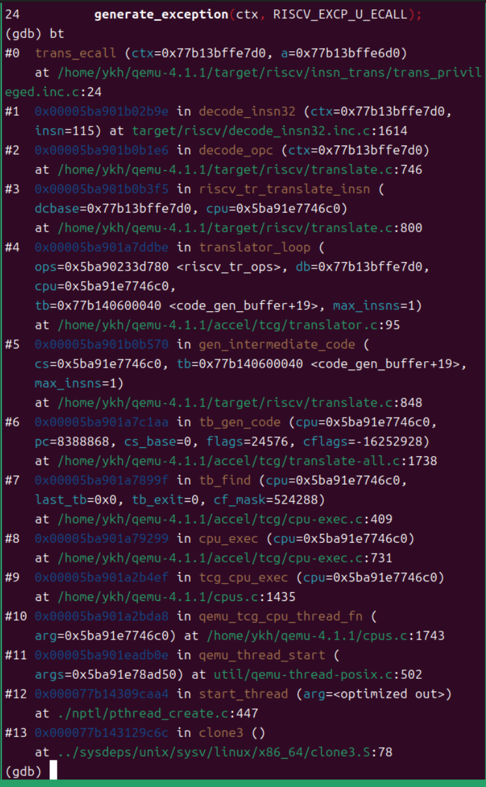

从调用栈可以看出，这是指令翻译阶段TCG（Tiny Code Generator）的翻译过程，QEMU正在翻译ecall指令，trans_ecall正在第24行被调用，接着我们输入list查看源码。

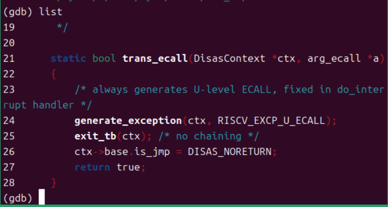

从源码可以看到：第24行调用generate_exception(ctx, RISCV_EXCP_U_ECALL)，这是生成用户态ecall异常，然后退出当前翻译块。于是我们可以输入step，进入generate_exception函数，然后输入list查看他的实现。

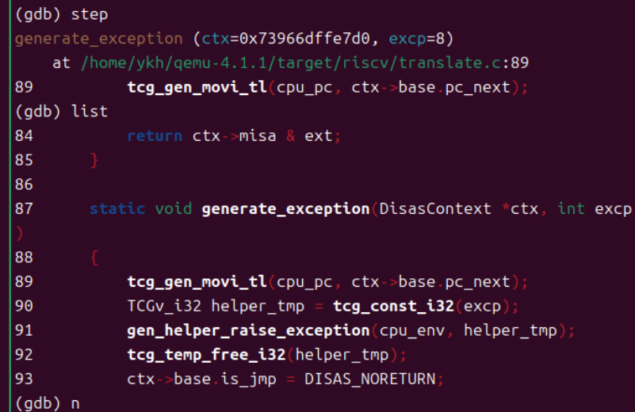

通过查看源码，我们可以对代码进行分析。

第89行：保存PC到cpu_pc寄存器

第90-92行：调用gen_helper_raise_exception来触发异常

第93行：设置不返回标志

与大模型进行交互之后，我们打上新的断点break riscv_cpu_do_interrupt，然后continue。在命中断点后停下，我们继续分析。

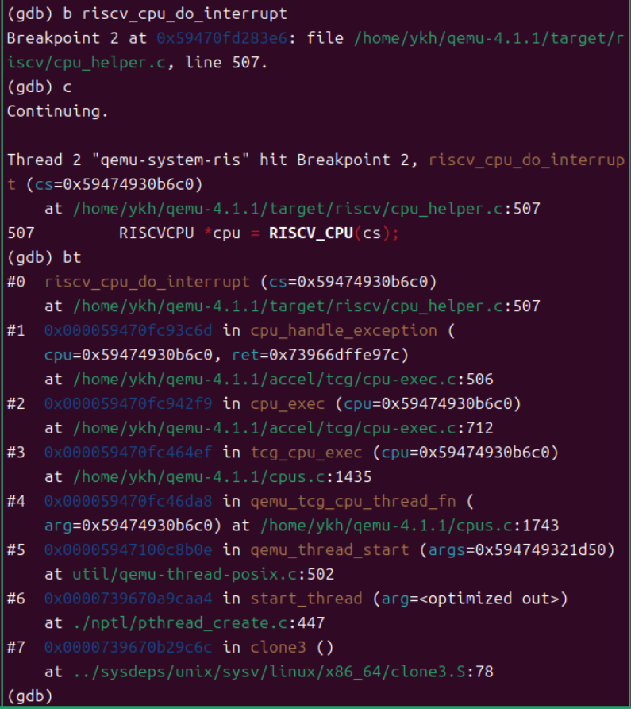

现在我们进入了异常处理的核心函数。通过与大模型的交互，我得知了从调用栈可以看出：cpu_handle_exception调用了riscv_cpu_do_interrupt，且这是在TCG执行阶段，不是翻译阶段，QEMU正在将硬件异常模拟给客户机（uCore）。

接着，我们执行next，然后查看env->pc等一系列相关值，得到的结果如下。

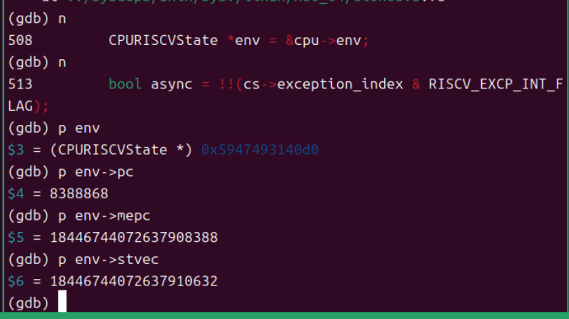

通过与大模型的交互，我们得知， env->pc = 8388868 (0x800104)这是ecall指令的地址，与之前uCore中ecall地址一致。我们继续输入next，在我们的不懈努力下，成功找到了ecall的专门处理逻辑。

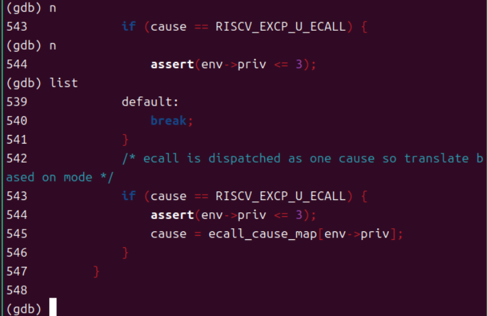

从代码可以看出：

第543行：判断是否是用户ecall

第544行：断言检查特权级

第545行：根据当前特权级映射真正的异常原因码

之后，我们继续运行next，就会发现进入了S-mode处理路径，异常被委托(delegated)给了S-mode处理。

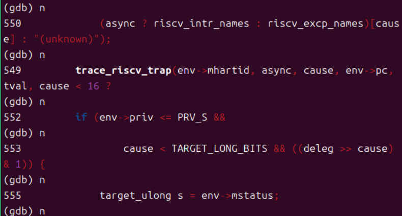

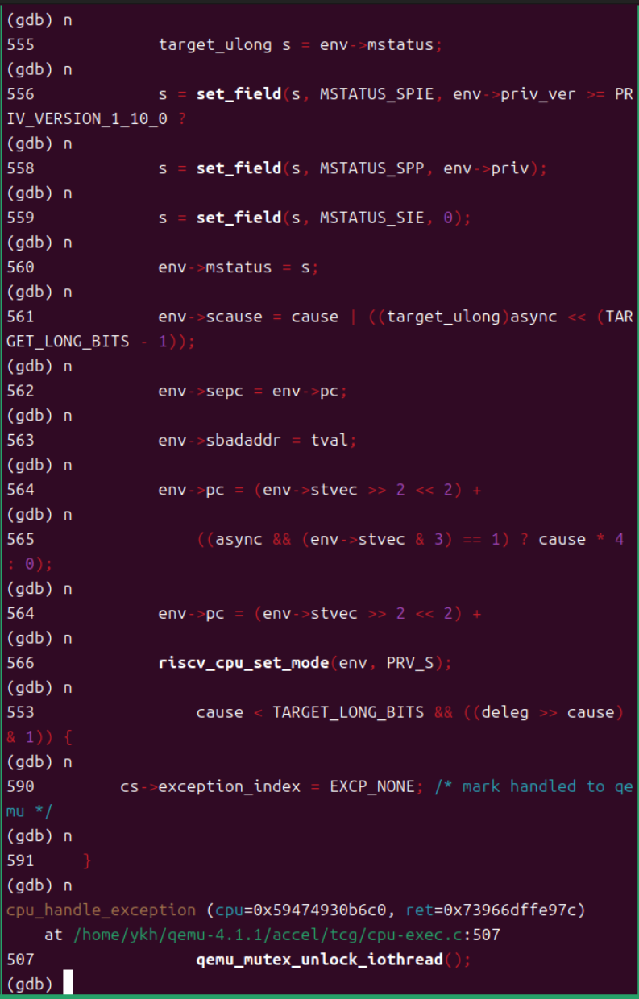

通过上图我们可以分析代码，通过设置scause = 0x8 | (async << 63)，sepc = env->pc，设置新的pc = stvec（中断向量地址），然后设置特权级为S-mode（PRV_S）并标记异常已处理（EXCP_NONE），最后返回到cpu_handle_exception。

这样，我们就完成了整个ecall的处理。QEMU模拟了硬件异常处理，设置了所有必要的CSR寄存器，跳转到了中断向量表并切换了特权级。

### 2.sret指令的跟踪

在完成了ecall流程的跟踪后，我们让ucore继续执行，接着来进行对sret处理流程的跟踪。

类似的，我们在第三个终端打上断点break __trapret,然后运行continue。

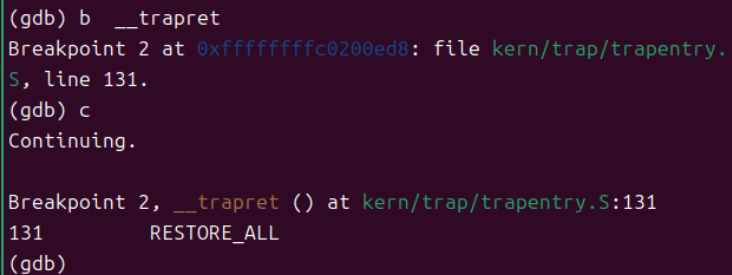

类似的，在触发断点之后，通过多次执行si单步调试，执行到sret前一条指令，然后切换在第二个终端里打上break trans_sret断点，接着回到第三个终端执行si，触发断点。

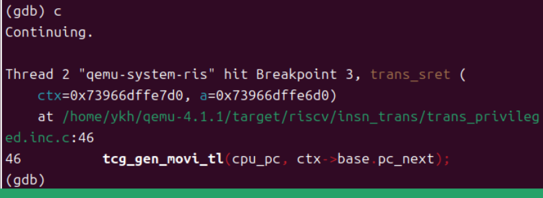

现在QEMU停在了trans_sret函数，这是sret指令的翻译函数。我们成功追踪到了系统调用返回的关键点。然后与前面类似，输入bt和list指令，观察一下他的调用栈和函数的完整实现。

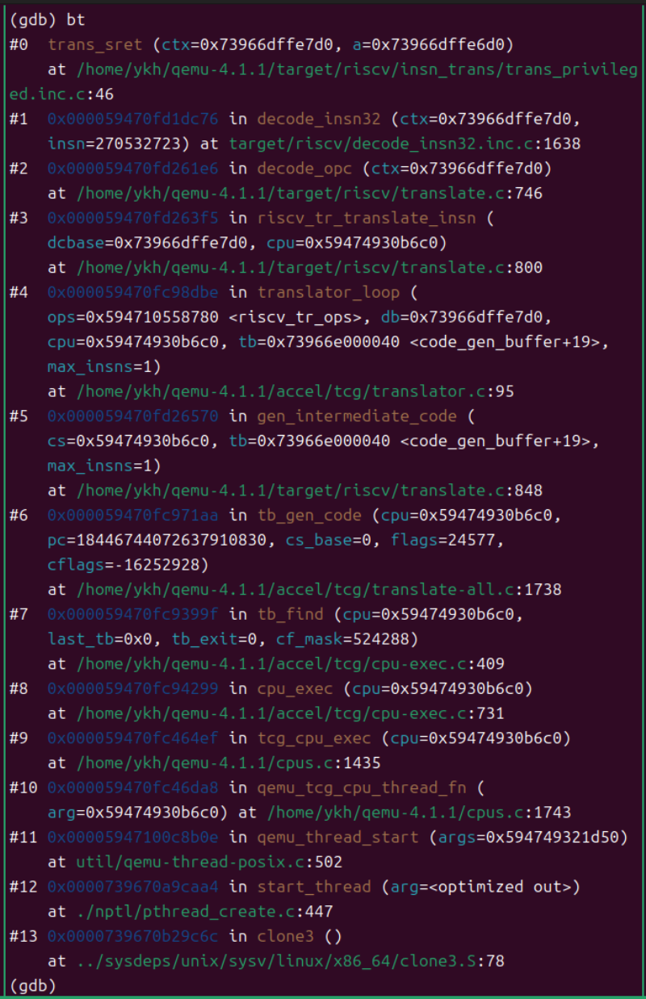

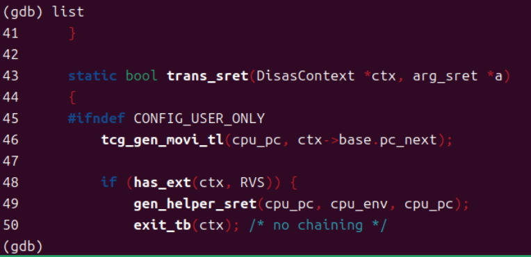

借助大模型的帮助，我们来理解sret的翻译过程。

第46行：tcg_gen_movi_tl(cpu_pc, ctx->base.pc_next)

将cpu_pc设置为ctx->base.pc_next

但这只是临时的，实际PC会在helper函数中从sepc恢复

第49行：gen_helper_sret(cpu_pc, cpu_env, cpu_pc)

调用helper_sret函数

helper_sret函数从sepc寄存器读取返回地址，从sstatus恢复特权级信息，然后切换特权级从S-mode回到U-mode并恢复中断使能状态。

第50-51行：标记翻译块结束

接着我们通过next指令逐步跟进代码，完整跟踪整个流程。

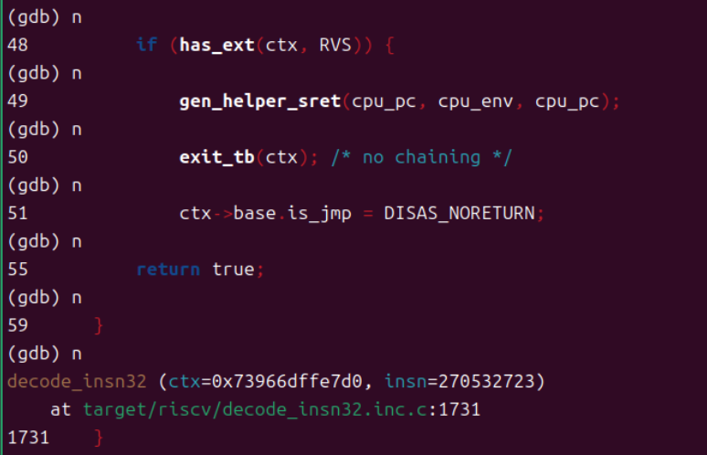

可以看到，代码主要是设置了临时PC并调用了gen_helper_sret(cpu_pc, cpu_env, cpu_pc)，最后标记翻译块结束
并返回到decode_insn32。TCG会在执行阶段调用helper_sret。

之后，在输入continue指令，我们可以看到第三个终端的输出。

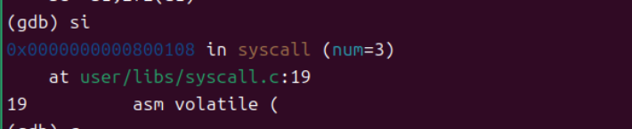

si命令执行后：看到00000000000800108 in syscall，这表示：我们已经成功执行了sret指令，现在已经返回到用户态，整个系统调用完整流程已完成！

